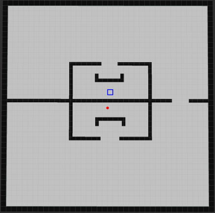
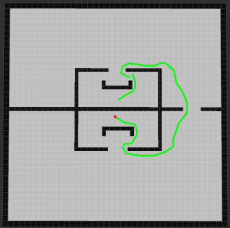

# RRT*-Connect
ROS Implementation of the RRT*-Connect algorithm. The algorithm is mostly developed as a novel algorithm developed as a combination of RRT* [1] and RRT-Connect [2], but is in essence very similar to the algorithm described in [3].

## Running the code

The code is developed using Python 2.7 and ROS Kinetic. The code was tested on Ubuntu 16.04. To run the code, navigate to your Catkin workspace and run:

1. ROS Core:      `roscore`
2. Map position:  `rosrun map_server map_server ./src/rrt_star_connect/map_position.yaml _frame_id:="odom"`
3. Pioneer World: `rosrun stage_ros stageros ./src/rrt_star_connect/pioneer.world`
4. Pioneer RViz:  `roslaunch rrt_star_connect pioneerRviz.launch`
5. RViz:          `rosrun rviz rviz`
6. Wrapper:       `rosrun rrt_star_connect wrapper.py`
7. Path planning: `rosrun rrt_star_connect rrt_star_connect.py`

## Experimental results

Running the script `rrt_star_connect.py` will generate an output file, and also run a path planning simulation on the following map:

The map shows the robot in blue, and a sample point used as the goal in this example. The results will be shown live, and after the number of iterations specified, the path should converge to a very short path from the origin to the goal, similar to the following image:

## References
[1] Sertac Karaman and Emilio Frazzoli. Sampling-based algorithms for optimal motion planning. CoRR, abs/1105.1186, 2011.

[2] J. J. Kuffner and S. M. LaValle. RRT-Connect: An efficient approach to single-query path planning. In Proceedings 2000 ICRA. Millennium Conference. IEEE International Conference on Robotics and Automation. Symposia Proceedings (Cat.No.00CH37065), volume 2, pages 995–1001 vol.2, April 2000. doi: 10.1109/ROBOT.2000.844730.

[3] Chen, Long & Shan, Yunxiao & Tian, Wei & li, Bijun & Cao, Dongpu. (2018). A Fast and Efficient Double-tree RRT*-like Sampling-based Planner Applying on Mobile Robotic Vehicles. IEEE/ASME Transactions on Mechatronics. PP. 1-1. 10.1109/TMECH.2018.2821767. 